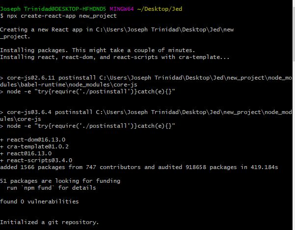

Create a NodeJS app - Hello World (ReactJS Framework)

1. Install NodeJS on your machine (https://nodejs.org/en/). Download the LTS(Long Term Support) version as this is the most stable version.

2. Install the downloaded file.

3. Open your terminal and type "npm -v". This should show the version number of Node package and that NodeJS has been successfully installed.

4. Since ReactJS runs on a NodeJS environment, we will use this as the front-end framework. Other famous frontend NodeJS frameworks include VueJS and AngularJS .ReactJS is a great framework to develop dynamic web apps, reusable components, faster rendering, flawless DOM manipulation using bootstrap applications and packages, great documentation and a helpful community. This is developed and maintained by Facebook, Inc.

5. On your Command Line (Terminal/GitBash/or Visual Studio Code), under your desired path directory, type "create-react-app new_project" or "npx create-react-app new_project". This will download and install packages needed for the React app. It may take a while but the prompt that the packages has been successfully installed will be "Happy hacking!".

6. On your Command Line, go to the path diretory of the created react app folder (in this case, the new_project folder) and type "npm start" to start the NodeJS server.

7. After doing npm start, this will automatically pop up your browser redirecting you to localhost:3000. This is the local server address for node. The React logo be shown as the default web page. Note: you can stop running the web server by pressing Ctrl+C or Command+C -- this will also stop the page load on the localhost:3000.

7. Pull up your text/code editor (Visual Studio Code/Sublime Text, etc.) on the path directory your react app is in.

8. Modify App.js (e.g. create a 
 tag and enclosed a string--"Hello World" within a div) to return a string of "Hello World!".

9. Save the text editor file(.html, .js, .css)as per your desired front end layout. This will automatically refresh the browser at localhost:3000 to reflect your changes.

########################
Cloning this repository
########################
1. Go to Sandz DO main Github page at https://github.com/sandzkube.

2. Proceed to the nodejs-hello world-react repo at https://github.com/sandzkube/hello-nodejs-reactjs.

3. On the repo's main page, click "Clone or download" button and copy the web URL.

4. On your Command Line (Terminal/GitBash/or Visual Studio Code), under your desired path directory, type "git clone <Web URL of repo>" and wait for the contents to download.

5. On your Command Line, go to the path diretory of the created react app folder (in this case, the new_project folder) and type "npm start" to start the NodeJS server.

*Note: you cannot run this when you have not gone through step #5 above on Creating a NodeJS app as running this on npm start will require the node_modules packages. Directly cloning this from the repo will not download the node_modules package.
